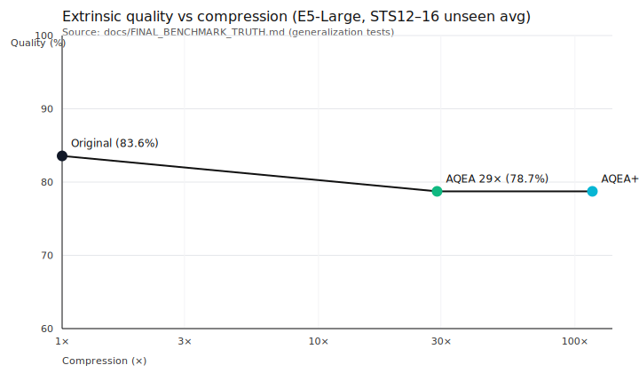
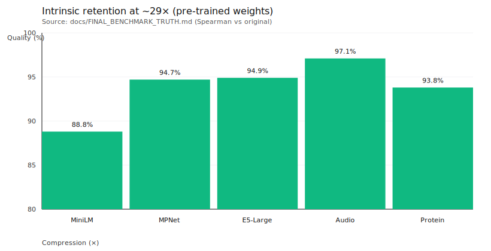
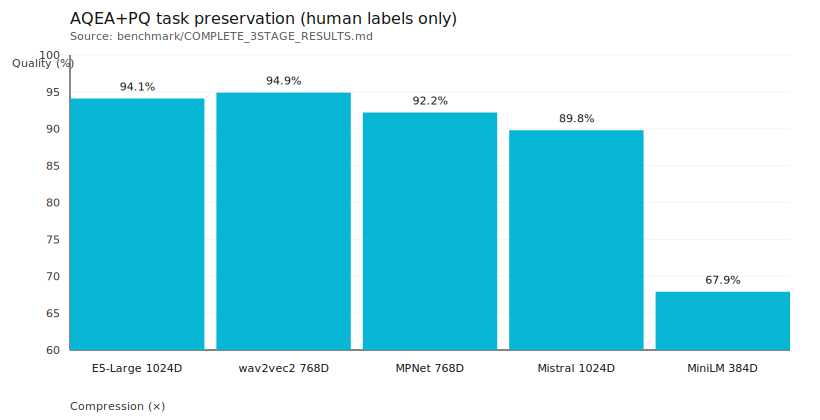

# AQEA: Technical Report — Domain-Adaptive Semantic Compression of Embeddings

**Author:** Sayed Amir Karim (NextX AG)  
**Organization:** NextX AG, Hauptstrasse 20, 6418 Rothenthurm, Switzerland  
**Contact:** compression@aqea.ai  
**Repository:** aqea-compress (this repo)

## How to cite

```text
Karim, Sayed Amir (NextX AG).
"AQEA: Technical Report — Domain-Adaptive Semantic Compression of Embeddings."
Version 0.1, 2026-01-03. DOI: 10.5281/zenodo.18138436 (https://doi.org/10.5281/zenodo.18138436).
Reproducibility source: aqea-compress commit f093b2d.
```

## Abstract

Embedding-based retrieval and semantic search systems incur significant cost in storage, bandwidth, and memory footprint due to high-dimensional float32 representations. AQEA addresses this by learning a domain-adaptive compression mapping (“Lens”) for a given embedding space and optionally combining it with Product Quantization (PQ) to reach higher ratios. The system supports multiple operating points (e.g., “discovery”, “balanced”, “precision”) to steer the quality–compression tradeoff without retraining the base embedding model. We report verified intrinsic and extrinsic evaluation results from this repository’s benchmark artifacts, including generalization tests on unseen datasets and reproducible certificates/hashes. We also provide a public verification path that allows third parties to validate API behavior on real embeddings without access to private datasets. Limitations and failure modes are explicitly discussed to prevent misuse.

## What this report claims / does NOT claim (scope)

### Claims (conservative, evidence-backed)

This report makes only claims that are backed by **auditable artifacts** in this repository or explicitly linked public reproducibility artifacts:

- **Extrinsic (human labels) generalization:** the STS12–16 unseen test results and the 117× claim boundary are taken from `docs/FINAL_BENCHMARK_TRUTH.md`.
- **Intrinsic retention (structure preservation):** model-specific intrinsic results are taken from `docs/FINAL_BENCHMARK_TRUTH.md`.
- **AQEA+PQ mode task preservation (where human labels exist):** summary values are taken from `benchmark/COMPLETE_3STAGE_RESULTS.md` (see explicit “human scores” note).
- **Public verification path:** API smoke test + HuggingFace verification pairs (Appendix D.4).

### Non-claims (explicit)

- **Higher ratios may be possible**, but are *not* claimed here unless a corresponding benchmark artifact is added and referenced.
- **No universal “best” claim:** results are dataset- and embedding-space-dependent.
- **No guarantee for arbitrary domains:** domain shift must be re-validated (see Limitations).
- **No cryptographic attestation:** this report does not claim cryptographic verification of server-side weights.

### Marketing alignment rule (public numbers)

Any public-facing numeric claim (website, demo, deck) must reference a **Claim ID** from this report (C1–C6) and its backing artifact.
If a number cannot be mapped to a Claim ID, it must be treated as **non-claim** until an auditable benchmark artifact exists.

## Executive Summary (evidence-backed)

This report is intentionally conservative: every quantitative statement below is backed by a repository artifact.

### Key verified findings

1. **Generalization on unseen data (extrinsic):** On STS12–16 (unseen) with E5-Large (1024D), AQEA at 29× shows **~5.1% loss vs. human labels**; adding PQ to reach **117× does not add measurable extra loss**.  
   Source: `docs/FINAL_BENCHMARK_TRUTH.md` (Generalization tests).
2. **Intrinsic retention (pre-trained weights):** Across several embedding spaces, AQEA-only at ~29–30× retains **~88–97% Spearman vs. original** (intrinsic).  
   Source: `docs/FINAL_BENCHMARK_TRUTH.md` (Intrinsic table).
3. **AQEA+PQ mode (where human labels exist):** For selected models with human-score evaluation, AQEA+PQ achieves **~92–95% task preservation** at ~236–241×.  
   Source: `benchmark/COMPLETE_3STAGE_RESULTS.md` (Models with human scores).

### Reproducibility at a glance

- **Repro without private data:** API smoke test + HuggingFace verification pairs (Appendix D.4).
- **Full benchmark reproduction:** requires locally generated pair files and model downloads (Appendix D).

## 1. Problem & Motivation

### 1.1 Why embeddings become expensive

- **Storage**: float32 embeddings scale linearly with \(N \times D \times 4\) bytes.
- **IO / bandwidth**: retrieval pipelines move vectors between services and storage layers.
- **Memory / cache pressure**: large indexes reduce cache hit rates and increase tail latency.
- **Vector DB cost**: many systems charge on stored bytes and memory footprint.

## 2. Method Overview (high-level)

### 2.0 Terminology (definitions used in this report)

- **AQEA**: the compression method/system described in this report (server-side weights, public API/CLI surface).
- **AQED**: a binary export/artifact format for embeddings used in demos and verification workflows.
- **PQ (Product Quantization)**: an optional quantization scheme producing compact codes + codebook.
- **Embedding space**: the vector space induced by a specific embedding model (dimension + geometry).
- **Lens**: a learned mapping specific to one embedding space that aims to preserve similarity structure under compression.
- **Operating point**: a named, reproducible configuration (canonical parameters) representing a quality–compression tradeoff.
- **Intrinsic evaluation**: compares compressed similarities against original-embedding similarities (structure preservation).
- **Extrinsic evaluation**: compares similarities against human labels / task ground truth (task preservation).

### 2.1 Compression as a function of domain and quality target

AQEA treats compression as a configurable operating point conditioned on:
- embedding space (model + dimension)
- domain / dataset distribution
- quality target (task-preservation vs. similarity-preservation)

### 2.2 “Lens” / steerable focus (conceptual)

A **Lens** is a learned mapping for a specific embedding space that aims to preserve similarity relationships under compression. The Lens:
- does **not** replace the embedding model
- can be trained without retraining the base transformer
- defines a controllable tradeoff between compression ratio and retrieval behavior

### 2.3 Pipeline (conceptual)

Common deployment uses AQEA compression, optionally combined with PQ for higher ratios.

This report focuses on **interfaces, guarantees, and empirical tradeoffs**, not proprietary training details.

## 3. Theoretical / Intuitive Explanation

### 3.1 Why high ratios can be possible

High-dimensional embedding spaces often contain redundancy relative to downstream similarity tasks. A learned mapping can preserve the subspace that matters most for similarity judgments within a target domain.

### 3.2 When it will not work

- domain shift outside the Lens’ operating assumptions
- extremely low-dimensional source embeddings (limited redundancy)
- tasks requiring fine-grained geometry not preserved by the chosen operating point

## 4. Evaluation Setup (Reproducibility)

This report references benchmark artifacts stored in this repository. For canonical “source of truth” and claim boundaries see:
- `docs/FINAL_BENCHMARK_TRUTH.md`
- `benchmark/`
- `benchmark_results/`

### 4.0 Intrinsic vs. extrinsic metrics (critical distinction)

We separate:

- **Intrinsic**: preservation of similarity structure relative to the original embedding space  
  (e.g., Spearman(original cosine, compressed cosine)).
- **Extrinsic**: preservation of task signal relative to human labels  
  (e.g., Spearman(compressed cosine, human labels) and retention vs baseline).

This matters because intrinsic quality can look high even when task performance drops, and vice versa.
Source of definitions and guardrails: `docs/FINAL_BENCHMARK_TRUTH.md` (“Benchmark-Typen: Intrinsic vs Extrinsic”).

### 4.1 Datasets (examples)

- STS-B (human similarity labels)
- STS12–16 (unseen generalization tests)
- Additional domain datasets where available (e.g., audio/video/protein benchmarks)

### 4.2 Metrics

- **Intrinsic**: Spearman(original cosine, compressed cosine)
- **Extrinsic**: Spearman(compressed cosine, human labels) relative to baseline
- Retrieval: Recall@K / NDCG where applicable

### 4.3 Baselines

- float32 baseline (uncompressed)
- PQ-only (where applicable)
- int8 / scalar quantization baselines (where available)

### 4.4 Integrity & threat model (what can be verified)

This report is designed to be **falsifiable**:

- **Data provenance**: all reported numbers are tied to repository artifacts (files under `docs/`, `benchmark/`, `benchmark_results/`).
- **Integrity anchors**:
  - Some benchmark reports include embedded `sha256:` certificates (e.g., OpenAI matrix markdown files).
  - Generated figures are derived from repo artifacts and accompanied by `assets/figures_data.json`, which records the extracted numeric inputs.
- **Reproducibility boundary**:
  - If an input dataset is not committed (e.g., large `training/data/*` files), reproduction requires obtaining the same dataset content via the documented workflow (see Appendix D).

Threat model (explicit non-goals):
- We do not claim resistance against adversarial embedding poisoning or model inversion attacks in this report.
- Public API verification checks endpoint behavior and contracts, not cryptographic attestation of server-side weights.

## 5. Results (Evidence-backed)

### 5.1 Key verified claims (to be kept conservative)

All numbers in this section must directly link to repo artifacts.

- Verified generalization results: `docs/FINAL_BENCHMARK_TRUTH.md`
- AQEA+PQ summaries: `benchmark/COMPLETE_3STAGE_RESULTS.md`
- Retrieval/latency matrices: `benchmark_results/030_matrix/*`

### 5.2 Generalization results (extrinsic; human labels)

The following table is copied from the repository’s verified “benchmark truth” document.
It evaluates **generalization**: training on STS-B and testing on **unseen** STS12–16.

Source: `docs/FINAL_BENCHMARK_TRUTH.md` (“Ergebnisse auf ungesehenen Daten”).

| Dataset | Split | Original (Spearman vs Human) | AQEA 29× | Loss | AQEA 29× + PQ (117×) | PQ Effect |
|---|---:|---:|---:|---:|---:|---:|
| STS12 | Test | 77.0% | 71.8% | -5.1% | 71.8% | -0.0% |
| STS13 | Test | 84.1% | 79.5% | -4.6% | 79.4% | -0.1% |
| STS14 | Test | 80.5% | 75.6% | -4.9% | 75.6% | +0.0% |
| STS15 | Test | 89.8% | 83.7% | -6.1% | 83.7% | +0.0% |
| STS16 | Test | 85.5% | 80.8% | -4.7% | 80.8% | +0.0% |

Summary reported by the artifact:
- average loss vs human on unseen test sets: **-5.1%**
- PQ additional loss: **0.0%**
- generalization gap: **1.5%**

### 5.3 Intrinsic retention (Spearman vs original)

Source: `docs/FINAL_BENCHMARK_TRUTH.md` (intrinsic table; pre-trained weights).

| Embedding space | Dim | Compression | Intrinsic Spearman vs original |
|---|---:|---:|---:|
| MiniLM | 384D → 13D | ~30× | 88.8% |
| MPNet | 768D → 26D | ~30× | 94.7% |
| E5-Large | 1024D → 35D | ~29× | 94.9% |
| Audio (wav2vec2) | 768D → 26D | ~30× | 97.1% |
| Protein (ESM) | 320D → 11D | ~29× | 93.8% |

### 5.4 AQEA+PQ results (task preservation where valid)

The artifact below explicitly distinguishes models **with** human scores vs those without.
Do not interpret “Task.Pres” as valid unless human labels exist.

Source: `benchmark/COMPLETE_3STAGE_RESULTS.md` (“Models with Human Scores”).

| Model | Compression | Similarity preservation | Task preservation | Note |
|---|---:|---:|---:|---|
| E5-Large 1024D | 241× | 91.7% | 94.1% | validated vs human |
| wav2vec2 768D | 236× | 94.9% | 94.9% | validated vs human |
| MPNet 768D | 236× | 91.0% | 92.2% | validated vs human |
| Mistral 1024D | 241× | 89.9% | 89.8% | validated vs human |
| MiniLM 384D | 219× | 73.1% | 67.9% | not recommended at this compression setting |

### 5.5 Operating points (canonical configs + stable naming)

To avoid ambiguity, we define **operating points** as:

- a **canonical configuration** (explicit parameters, reproducible)
- plus an optional **alias name** (“discovery / balanced / precision”)

Operating points are **embedding-space specific** (model + dimension) and must be re-validated on domain shifts.

#### Definitions

- **Precision**: prioritize quality; use the lowest compression that meets cost targets.
- **Balanced**: default tradeoff for production; conservative quality target with meaningful cost reduction.
- **Discovery**: prioritize compression and scale; accept larger quality loss if validated for the task.

#### Canonical operating points (E5-Large 1024D, evidence-backed)

These three points are supported by **extrinsic** artifacts (human labels).

| Alias | Canonical config | Compression | Metric validity | Primary artifact |
|---|---|---:|---|---|
| Precision | AQEA-only, canonical dims for the embedding space | ~29× | extrinsic + intrinsic (see artifact) | `docs/FINAL_BENCHMARK_TRUTH.md` |
| Balanced | AQEA + PQ, “117×” setting used in generalization tests | 117× | **extrinsic** (unseen STS12–16) | `docs/FINAL_BENCHMARK_TRUTH.md` |
| Discovery | AQEA + PQ, configuration as in the benchmark suite summary | 241× | **extrinsic** (human labels) | `benchmark/COMPLETE_3STAGE_RESULTS.md` |

Notes:
- “117×” and “241×” are **two different AQEA+PQ configurations** evaluated in different artifact suites.
- Treat aliases as stable *labels*; the canonical configs are the source of truth.

#### Canonical operating points (OpenAI 1536D / 3072D, retrieval metrics only)

For OpenAI embedding spaces, some benchmark artifacts report retrieval metrics and intrinsic correlations but explicitly note
that “task preservation” is not valid without human labels in that setup.

| Alias | Canonical config | Compression | Evidence type | Primary artifact |
|---|---|---:|---|---|
| Precision | AQEA-only, `targetDims=52` (1536D) / `targetDims=105` (3072D) | ~29× | intrinsic/retrieval | `/api/v1/models` + `benchmark_results/030_matrix/*` |
| Balanced | AQEA 29× + PQ-64 | 96× (1536D) / 192× (3072D) | intrinsic/retrieval | `benchmark_results/030_matrix/openai_small_1536d.md`, `benchmark_results/030_matrix/openai_large_3072d.md` |
| Discovery | AQEA 29× + PQ-32 | 192× (1536D) / 384× (3072D) | intrinsic/retrieval | `benchmark_results/030_matrix/openai_small_1536d.md`, `benchmark_results/030_matrix/openai_large_3072d.md` |

Guardrail:
- Do **not** present these as “task preservation” unless a benchmark with human labels is used.

### 5.2 Tradeoff curves

Include plots in `assets/`:
- compression ratio vs quality (intrinsic + extrinsic)
- operating points: discovery / balanced / precision

Figures (generated from repo artifacts, no external plotting deps):
- `assets/figure_tradeoff_extrinsic_e5.svg`
- `assets/figure_intrinsic_29x_models.svg`
- `assets/figure_aqea_pq_task_preservation.svg`

To reproduce:

```bash
python3 aqea-technical-report/repro/make_figures.py
```

#### Figure 1 — Extrinsic tradeoff (E5-Large, unseen generalization)



Caption: Extrinsic Spearman vs human labels for E5-Large, averaged over STS12–16 (unseen). Points correspond to
Original (1×), AQEA-only (~29×), and AQEA+PQ (117×).  
Source: `docs/FINAL_BENCHMARK_TRUTH.md` (generalization tests).

#### Figure 2 — Intrinsic retention at ~29× (pre-trained weights)



Caption: Intrinsic Spearman vs original embeddings for multiple embedding spaces at ~29–30× compression using pre-trained weights.  
Source: `docs/FINAL_BENCHMARK_TRUTH.md` (intrinsic table).

#### Figure 3 — AQEA+PQ task preservation (human labels only)



Caption: Task preservation (%) for AQEA+PQ on models where human labels are available in the benchmark suite.  
Source: `benchmark/COMPLETE_3STAGE_RESULTS.md` (“Models with Human Scores”).

## 6. Ablations / Comparisons

Where artifacts exist, compare:
- Lens vs. no-Lens at same compression ratio
- PQ impact on extrinsic metrics (task preservation)

## 7. Practical Deployment

### 7.1 CLI/API workflow (high-level)

- Discover supported models: `GET /api/v1/models`
- Compress batch: `POST /api/v1/compress/batch`
- Verify key + quotas: `GET /api/v1/auth/verify`

### 7.2 Guardrails, failure modes, rollback

- Always A/B test on a representative slice before migrating the full index.
- Keep a rollback path (dual-write or staged migration).
- Monitor retrieval KPI drift and re-run evaluation on domain changes.

## 8. Limitations & When NOT to use

This section is intentionally explicit for credibility. If any of the following apply, do **not** deploy without re-validation.

### 8.1 Metric misuse (most common failure)

- **Do not treat intrinsic metrics as task performance.** High intrinsic Spearman can coexist with degraded task utility.
- **Do not claim “task preservation” without human labels.** Some artifact suites explicitly state when “scores” are not human judgments.
  - Example: OpenAI matrix artifacts are retrieval/intrinsic-focused; they do not constitute extrinsic task validation.

### 8.2 Domain shift and distribution drift

- If your production distribution differs materially from the evaluation distribution, quality can drift.
- Re-run the evaluation workflow on a representative slice whenever:
  - your corpus changes (new language/domain)
  - your embedding model changes (different geometry)
  - your query distribution changes (new retrieval tasks)

### 8.3 Low-dimensional embedding spaces (compression ceiling)

- Very small source dimensions may not have enough redundancy for aggressive high-compression configurations.
- Evidence example: MiniLM 384D is **not recommended** at the highest-compression settings in the suite summary.
  Source: `benchmark/COMPLETE_3STAGE_RESULTS.md`.

### 8.4 PQ-specific constraints

- PQ workflows may require:
  - availability of a compatible codebook on the server, or a training step
  - decoding/codebook access to compute similarities from PQ codes
- Operationally, PQ introduces additional moving parts (codebook versioning, rollout/rollback).

### 8.5 Deployment guardrails (recommended)

- **A/B evaluation first:** run operating points on a representative dataset slice and compare retrieval KPIs (Recall@K, NDCG, human eval where possible).
- **Rollback path:** keep a reversible migration strategy (dual-write or staged index migration).
- **Monitoring:** track KPI drift and re-evaluate periodically; do not assume once-validated implies forever-valid.

## Appendix A — Public verification path (API)

This repo includes a public verification script that uses **real vectors** from a public AQED export.

See:
- `VERIFICATION.md`
- `repro/api_smoketest.py`

## Appendix B — Artifact map (filled)

Provide a table mapping every reported number to:
- file path
- line / section
- hash/certificate (if provided)

### Claims table (v0.1)

| Claim ID | Claim (short) | Metric type | Primary artifact | How to verify |
|---|---|---|---|---|
| C1 | 117× at ~95% retention vs baseline **extrinsic Spearman (human labels)** on unseen STS12–16 (E5-Large) | extrinsic | `docs/FINAL_BENCHMARK_TRUTH.md` | Run `python3 benchmark/scripts/test_aqea_generalization.py` (requires the referenced `training/data/*_pairs.json` to exist locally) |
| C2 | PQ adds ~0.0% extra loss in that setup | extrinsic | `docs/FINAL_BENCHMARK_TRUTH.md` | Same as C1; compare “AQEA” vs “AQEA + PQ” test rows |
| C3 | intrinsic retention ~88–97% at ~29× (pre-trained weights) | intrinsic | `docs/FINAL_BENCHMARK_TRUTH.md` | Recompute intrinsic Spearman with weights + benchmark pairs (see “Files” section in artifact) |
| C4 | AQEA+PQ task preservation ~92–95% (where human labels exist) | extrinsic | `benchmark/COMPLETE_3STAGE_RESULTS.md` | Cross-check summary table; reproduce via benchmark suite scripts (see `benchmark/`) |
| C5 | OpenAI retrieval metrics + integrity anchors (certificates) | intrinsic/retrieval | `benchmark_results/030_matrix/openai_*.md` | Validate file integrity via embedded `sha256:` certificates; rerun matrix benchmark generator if desired |
| C6 | Public API verification on real vectors (no private data) | engineering | `VERIFICATION.md`, `repro/api_smoketest.py` | Run: `python3 repro/api_smoketest.py --base-url https://api.aqea.ai` (+ set `AQEA_API_KEY` for auth checks) |

### Reproduction commands (minimal)

#### R1: Generalization benchmark (E5-Large, STSB → STS12–16)

```bash
python3 benchmark/scripts/test_aqea_generalization.py
```

Notes:
- Requires Python deps used by the script (`numpy`, `scipy`).
- Requires the referenced input files to exist locally. If they are not present, generate them via Appendix D:
  - `training/data/stsb_intfloat_e5_large_v2_1024d_pairs.json`
  - `training/data/sts12_e5large_1024d_pairs.json` … `sts16_e5large_1024d_pairs.json`
  - `weights/aqea_text_e5large_1024d.aqwt`
- Output is also written to:
  - `docs/sprints/043_sprint_scalar-precision-boost/generalization_benchmark_results.json`

Expected (from `docs/FINAL_BENCHMARK_TRUTH.md`):
- unseen test loss vs human labels ≈ **-5.1%**
- PQ additional loss ≈ **0.0%**

#### R2: Public API verification (real vectors, bring-your-own-key)

```bash
python3 aqea-technical-report/repro/api_smoketest.py --base-url https://api.aqea.ai --sample 8
```

Authenticated checks:

```bash
export AQEA_API_KEY="aqea_..."
python3 aqea-technical-report/repro/api_smoketest.py --base-url https://api.aqea.ai --sample 8
```

#### R3: Integrity anchors for matrix benchmarks (OpenAI)

Check embedded certificates in:
- `benchmark_results/030_matrix/openai_small_1536d.md` (Certificate: `sha256:69970d8…`)
- `benchmark_results/030_matrix/openai_large_3072d.md` (Certificate: `sha256:d777e2b…`)

### B.1 Integrity anchors (this report package)

- Paper source: `aqea-technical-report/TECHNICAL_REPORT.md` (source commit: `c0ea33f`)
- HuggingFace verification dataset:
  - repo: `nextxag/aqea-sts-verification-pairs`
  - pinned revision: `949d0bf9a0643ead63bb198ee6506fbf057d9f02`
  - manifest: `MANIFEST.sha256` in the dataset repo

- Local artifact checksums:
  - `aqea-technical-report/ARTIFACTS.sha256` (sha256 for the key files cited by this report)

To reproduce `ARTIFACTS.sha256`:

```bash
python3 aqea-technical-report/repro/hash_artifacts.py
```

## Appendix C — Artifact index (quick reference)

This index is intended for reviewers to quickly locate evidence.

### C.1 Canonical “source of truth” documents

- `docs/FINAL_BENCHMARK_TRUTH.md` — conservative verified claims; intrinsic vs extrinsic separation; generalization tests.
- `benchmark/COMPLETE_3STAGE_RESULTS.md` — AQEA+PQ suite summary; explicitly flags when human labels are/aren’t valid.
- `benchmark_results/030_matrix/` — retrieval/latency matrices; some include `sha256:` certificates.

### C.2 Verification path (public, no private data)

- `aqea-technical-report/VERIFICATION.md` — bring-your-own-key verification instructions.
- `aqea-technical-report/repro/api_smoketest.py` — dependency-free smoke test using real AQED vectors.

### C.3 Figures (generated deterministically)

- `aqea-technical-report/repro/make_figures.py` — generates SVGs from artifacts (stdlib only).
- `aqea-technical-report/assets/figure_tradeoff_extrinsic_e5.svg`
- `aqea-technical-report/assets/figure_intrinsic_29x_models.svg`
- `aqea-technical-report/assets/figure_3stage_task_preservation.svg`
- `aqea-technical-report/assets/figures_data.json` — extracted numeric data used for the figures.

## Appendix D — Obtaining evaluation datasets (public)

This report intentionally references **public** benchmark datasets (HuggingFace) so that third parties can reproduce key results.
Large generated embedding files may not be committed to git; you can generate them locally as follows.

See also: `aqea-technical-report/DATASETS.md` (dataset IDs + expected filenames).

### D.1 Recommended environment (isolated)

```bash
python3 -m venv .venv
source .venv/bin/activate
python3 -m pip install --upgrade pip
python3 -m pip install numpy scipy datasets sentence-transformers
```

### D.2 Generate STS-B pairs (E5-Large 1024D)

This produces the file used by the generalization benchmark:
`training/data/stsb_intfloat_e5_large_v2_1024d_pairs.json`.

```bash
python3 training/scripts/generate_stsb_benchmark.py \
  --model intfloat/e5-large-v2 \
  --split test \
  --output-dir training/data
```

### D.3 Generate STS12–16 pairs (E5-Large 1024D, unseen test sets)

This produces:
`training/data/sts12_e5large_1024d_pairs.json` … `training/data/sts16_e5large_1024d_pairs.json`.

```bash
python3 benchmark/scripts/generate_all_embeddings.py
```

Notes:
- The scripts download datasets from HuggingFace and model weights from the model hub.
- For long-term reproducibility (papers/citations), mirror the generated pair files to a stable public artifact store
  (e.g., HuggingFace Datasets or a GitHub Release) and pin a revision + checksum.


### D.4 Pre-generated dataset (HuggingFace)

For convenience, pre-generated embedding pairs are available on HuggingFace:

🔗 **https://huggingface.co/datasets/nextxag/aqea-sts-verification-pairs**

This dataset contains:
- STS-B embedding pairs (E5-Large 1024D)
- STS12–16 embedding pairs (E5-Large 1024D)
- Human similarity scores
- SHA256 checksums for verification

Third parties can use this dataset to reproduce our generalization benchmarks without generating embeddings locally.

```python
from huggingface_hub import hf_hub_download

# Download the checksum manifest (and optionally the pair files under data/*)
manifest_path = hf_hub_download(
    repo_id="nextxag/aqea-sts-verification-pairs",
    repo_type="dataset",
    filename="MANIFEST.sha256",
)
print("Manifest:", manifest_path)
```
